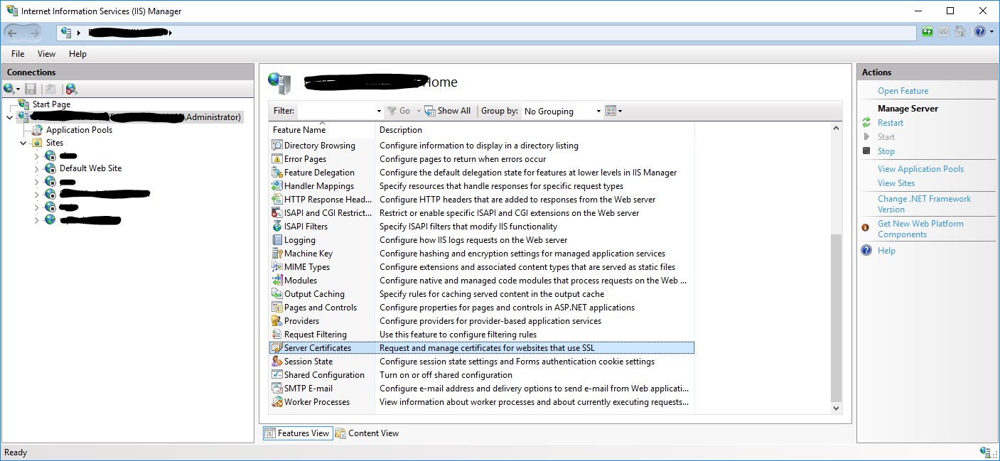
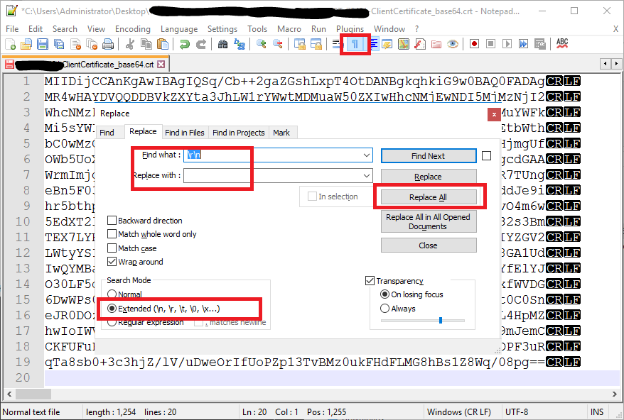

# How to setup client certificate which certificate chain Authentication in IIS

## Prerequisites
* Windows Server 2016 or above with installed:
    * Powershell
    * IIS
    * WireShark
    * Chrome browser
* Assign your PC a hostname, for example `dev-example`.
    * Restart of PC is required
* Active Directory
    * Add your PC to a domain (for example to a test domain e.g. `contoso.com`)
        * Requires DNS setup - in lab you can use hosts file.
        * Sometime restart of PC is required before you will be able to ad it to domain.

<a name="generate_cert"></a>
## Generate certificates
Run this command to generate required certificates and install them in proper (LM/CU) certificates stores.
```powershell
.\generate-cert.ps1 -hostname "dev-example" -domain "contoso.com" -prefixName "CUST-0001-" -password 'Pa$$word'
```
The script will output all crt, pfx files into `Out` dir.
Some scripts will be also automatically installed to Local-Machine and Current-User certificate stores.

## Configure hosts file
1. Run `Notepad.exe` as Administrator and open from `%systemroot%\System32\drivers\etc` a host file. **(Use All Files (\*.\*))**
2. Add entry 127.0.0.1 and FQDN of your PC (e.g. dev-example.contoso.com)
```txt
    127.0.0.1    dev-example.contoso.com
```

## Add Feature IIS Client Certificate Mapping Authentication
To allow user to authenticate with client certificate authentication we need to enable `Client Certificate Mapping Authentication` in Windows Feature.


## Configure IIS
### How to install an SSL/TLS Certificate in IIS
#### Prerequisites
* [Generate certificates by running script `generate-cert.ps1`](#generate_cert)
    * Server Certificate
    * Intermediate Certificate
    * Private Key

1. In IIS Manager in the left `Connections` menu, select the server name (host) where you want to install the certificate.
2. In the center menu, click the Server Certificates icon under the Security section near the bottom.

3. In the right Actions menu, click `Import...`.

4. In the Import Certificate dialog click `...` button to browse Server Certificate private key (*.pfx) file created by `generate-cert.ps1` script.

5. Enter Private key password - it should be the same as you provided during run of `generate-cert.ps1` script.
6. Leave `Personal` Certificate Store and press OK button.

## Configure SSL Settings
1. In IIS Manager in the left `Connections` menu, click `SSL Settings`.

2. In opened settings check `Require SSL` and under Client Certificate choose `Require`.

3. To Save click on `Apply` button under `Actions` panel.

## Binding SSL Certificate to Web Application
1. From the left `Connections` menu, expand your server’s name, expand the `Sites` folder, and then select the site (e.g. `Default Web Site`) that you want to secure.
2. In the right Actions menu, click `Bindings…`

3. In opened dialog click `Add` button and enter FQDN (e.g. `dev-example.contoso.com`) into Hostname filed.
4. From `SSL Certificate` dropdown select installed in the previous section Server Certificate.
5. Then click OK button and Close.

<a name="generate_cert_public_key"></a>
## Convert Client Certificate to base 64 format
Run this command to generate base_64 version of a certificate.
(assuming that client cert name was CUST-0001-ClientCertificate.crt)
```powershell
& .\Out\certutil.exe -encode "CUST-0001-ClientCertificate.crt" ".\Out\CUST-0001-ClientCertificate_base64.crt"
```
## Map Client Certificate
1. In order to configure the server to know which client certificate it needs to validate in IIS Manager in the left `Connections` menu, expand your server’s name, expand the `Sites` folder, and then select the site (e.g. `Default Web Site`).
2. Click on `Configuration Editor`.

3. In opened settings from dropdown choose `system.webServer/security/authentication/iisClientCertificateMappingAuthentication` and enable the setting then Apply changes.


### Many-to-one
1. To add new mapping click `...`

2. Fill out the properties for a mapping and repeat for each user you want to configure for access or denial. Remember that you need the client certificate and root CA certificate installed on all the user’s mmc. **(In order for this to work you need to enter a valid username and password)**

3. Now we need to create some rules to go with this mapping so the server can determine if a client is allowed in or not. It’s a  so click on the rules property and the `...`button.

4. Add as many rules you like - on below example we have two rules where the server will check the client certificate to see if it’s signed by the correct CA Issuer (e.g. `dev-example.local`) and Subject (e.g. `dev-example`). For more details please visit the [IIS Many-To-One Mapping](http://www.iis.net/configreference/system.webserver/security/authentication/iisclientcertificatemappingauthentication/manytoonemappings) reference for more documentation.

5. When you don Apply all changes.


### One-To-Many
This approach means that we need an individual client certificate for each user mapping. You can either disable the many-to-one mapping and use the same certificate and user or create new ones. 
1. Go to the `Configuration Editor` and open the `system.webServer/security/authentication/iisClientCertificateMappingAuthentication` section. 
2. Click the `...` button of the `oneToOneMappings`.

3. To `Add` new mapping we need public key of SSL Certificate - we exported it to base64 format already in step [Convert Client Certificate to base 64 format](#generate_cert_public_key). Open a file in notepad `.\Out\CUST-0001-ClientCertificate_base64.crt`.

4. Remove opening and closing tags 
```txt
-----BEGIN CERTIFICATE-----
...
-----END CERTIFICATE-----
```
5. Replace all new line characters so the certificate could be in a single line.
Alternatively you can use `Notepad++` and replace all occurrence of `\r\n` (new line characters) with empty string.

6. The final result should look like this.

7. Now copy the line and fill `oneToMany` entires. Paste copied certificate to certificate property of a new entry - provide a user which has required access permission to web application. **(You can map this way as many client certificate as you want.)**

8. When you don close the dialog and Apply changes.


## Require `Certificate Request` for during TLS handshake (Enable Negotiate Client Certificate)
Force IIS to require `Certificate Request` during TLS handshake.
1. Run `cmd` as Administrator
2. Assuming that FQDN of your host PC is `dev-example.contoso.com` run commands to get `Application ID` and `Certificate Hash` values for a sslcert configuration which Hostname:port equls `dev-example.contoso.com`.
```cmd
netsh http show sslcert hostname=dev-example.contoso.com:443
```
Output should look like this:
```cmd
SSL Certificate bindings:
-------------------------

    Hostname:port                : dev-example.contoso.com:443
    Certificate Hash             : <your_certificate_hash>
    Application ID               : {<your_web_app_id>}
    Certificate Store Name       : MY
    Verify Client Certificate Revocation : Enabled
    Verify Revocation Using Cached Client Certificate Only : Disabled
    Usage Check                  : Enabled
    Revocation Freshness Time    : 0
    URL Retrieval Timeout        : 0
    Ctl Identifier               : (null)
    Ctl Store Name               : (null)
    DS Mapper Usage              : Disabled
    Negotiate Client Certificate : Disabled <-- We need to enable this one
    Reject Connections           : Disabled
    Disable HTTP2                : Not Set
```
3. Delete the sslcert configuration.
```cmd
netsh http delete sslcert hostnameport=dec-example.contoso.com:443
```
4. Create the sslcert configuration but this time with enabled `Negotiate Client Certificate`.
```cmd
netsh http add sslcert hostnameport=dec-example.contoso.com:443 certhash=<your_certificate_hash> appid={<your_web_app_id>} certstorename=MY verifyclientcertrevocation=enable VerifyRevocationWithCachedClientCertOnly=disable UsageCheck=enable clientcertnegotiation=enable
```
5. Check the result of our work.
```cmd
netsh http show sslcert hostname=dev-example.contoso.com:443
```
Output should look like this:
```cmd
SSL Certificate bindings:
-------------------------

    Hostname:port                : dev-example.contoso.com:443
    Certificate Hash             : <your_certificate_hash>
    Application ID               : {<your_web_app_id>}
    Certificate Store Name       : MY
    Verify Client Certificate Revocation : Enabled
    Verify Revocation Using Cached Client Certificate Only : Disabled
    Usage Check                  : Enabled
    Revocation Freshness Time    : 0
    URL Retrieval Timeout        : 0
    Ctl Identifier               : (null)
    Ctl Store Name               : (null)
    DS Mapper Usage              : Disabled
    Negotiate Client Certificate : Enabled
    Reject Connections           : Disabled
    Disable HTTP2                : Not Set
```

# Useful links
* [How to Install an SSL/TLS Certificate In Microsoft IIS 7](https://www.thesslstore.com/knowledgebase/ssl-install/microsoft-iis-7-ssl-installation/)
* [How to Import and Export SSL Certificates in IIS 7](https://www.digicert.com/kb/ssl-support/pfx-import-export-iis-7.htm)
* [Configure IIS to use your self signed certificates with your application including IIS client certificate mapping authentication](https://blog.jayway.com/2014/10/27/configure-iis-to-use-your-self-signed-certificates-with-your-application/)
* [Configuring IIS for Client Certificate Mapping Authentication](https://medium.com/@yildirimabdrhm/configuring-iis-for-client-certificate-mapping-authentication-d7f707506a97)
* [An Introduction to Mutual SSL Authentication](https://www.codeproject.com/Articles/326574/An-Introduction-to-Mutual-SSL-Authentication)
* [IIS SSL Certificate Renewal Pain](https://weblog.west-wind.com/posts/2014/may/08/iis-ssl-certificate-renewal-pain)
* [An Overview of One-Way SSL and Two-Way SSL](https://tutorialspedia.com/an-overview-of-one-way-ssl-and-two-way-ssl/)
* [Troubleshooting SSL related issues (Server Certificate)](https://docs.microsoft.com/en-us/iis/troubleshoot/security-issues/troubleshooting-ssl-related-issues-server-certificate)
* [Debugging client certificate issues on IIS](https://serverfault.com/questions/946277/debugging-client-certificate-issues-on-iis)

## SSL/TLS Handshake
* [The SSL/TLS handshake](https://subscription.packtpub.com/book/networking_and_servers/9781785887819/4/ch04lvl1sec27/the-ssl-tls-handshake)
* [TLS Handshake : Under The Hood](https://medium.com/@technospace/tls-handshake-under-the-hood-79d20c0020de)
* [SSL Handshake explained](https://medium.com/@kasunpdh/ssl-handshake-explained-4dabb87cdce)

## Set Client Negotiation Certificate
* [Require Client Certificates in IIS 7.5](https://blogs.iis.net/rickbarber/require-client-certificates-in-iis-7-5)
* [Checking IIS Client Negotiation Certificate Status for Mutual Authentication](https://help.sap.com/doc/329ac769552a411b97bc7adb991b6197/3.0.12/en-US/6ff0a9b6e1c743d48d1e57235d297c1c.html)

## Client Certificate Authentication
* [Client Certificate Authentication (Part 1)](https://docs.microsoft.com/en-gb/archive/blogs/kaushal/client-certificate-authentication-part-1)
* [Client Certificate Authentication (Part 2)](https://docs.microsoft.com/en-gb/archive/blogs/kaushal/client-certificate-authentication-part-2)
* [Self-Signed, Root CA and Intermediate CA Certificates](https://docs.microsoft.com/en-gb/archive/blogs/kaushal/self-signed-root-ca-and-intermediate-ca-certificates)
* [Client Certificate Mapping Authentication <clientCertificateMappingAuthentication>](https://docs.microsoft.com/en-us/iis/configuration/system.webServer/security/authentication/clientCertificateMappingAuthentication)
* [IIS Client Certificate Mapping Authentication <iisClientCertificateMappingAuthentication>](https://docs.microsoft.com/en-us/iis/configuration/system.webServer/security/authentication/iisClientCertificateMappingAuthentication/)
* [Client Certificate Authentication](https://textslashplain.com/2020/05/04/client-certificate-authentication/)
* [Configuring SSL and Client Certificate Validation on Windows](https://www.codeproject.com/Articles/1094525/Configuring-SSL-and-Client-Certificate-Validation)
* [Configuring Client Authentication Certificates in Web Browsers](https://www.ssl.com/how-to/configuring-client-authentication-certificates-in-web-browsers/)
## New-SelfSignedCertificate
* [Creating Certificates](https://adamtheautomator.com/new-selfsignedcertificate/)
* [Generating a Root CA Certificate and Signed Certificates for dev](https://spandothers.wordpress.com/2018/02/20/generating-a-root-ca-certificate-and-signed-certificates-for-dev-using-powershell/)

## Tools
* [MakeCert 1](https://docs.microsoft.com/en-us/windows/win32/seccrypto/makecert)
* [MakeCert 2 (recommended)](https://blog.jayway.com/2014/09/03/creating-self-signed-certificates-with-makecert-exe-for-development/)
* [MakeCert 3](https://brockallen.com/2015/06/01/makecert-and-creating-ssl-or-signing-certificates/)
* [MakeCert 4](https://stackoverflow.com/questions/13332569/how-to-create-certificate-authority-certificate-with-makecert)
* [MakeCert 5](https://stackoverflow.com/questions/2955049/setting-key-usage-attributes-with-makecert)
* [Pvk2Pfx](https://docs.microsoft.com/en-us/windows-hardware/drivers/devtest/pvk2pfx)
### PowerShell
* [New-SelfSignedCertificate](https://docs.microsoft.com/en-us/powershell/module/pki/new-selfsignedcertificate?view=windowsserver2019-ps)
* [Powershell Self Signed Certificate](https://gist.github.com/RomelSan/bea2443684aa0883b117c37bac1de520)

## Issues
* [SSL Certificate disappears from IIS 1](https://serverfault.com/questions/72297/ssl-certificates-disappear-iis)
* [SSL Certificate disappears from IIS 2](https://stackoverflow.com/questions/21009834/installed-ssl-certificate-in-certificate-store-but-its-not-in-iis-certificate)
* [SSL Certificate disappears from IIS 3](https://forums.asp.net/t/1973311.aspx?SSL+Certificate+not+importing+in+IIS+7+5)
* [MakeCert and 'Subject Alternative Name' field](https://stackoverflow.com/questions/6383054/add-or-create-subject-alternative-name-field-to-self-signed-certificate-using)
* [NET::ERR_CERT_COMMON_NAME_INVALID 1](https://stackoverflow.com/questions/27294589/creating-self-signed-certificate-for-domain-and-subdomains-neterr-cert-commo)
* [NET::ERR_CERT_COMMON_NAME_INVALID 2](https://serverfault.com/questions/880804/can-not-get-rid-of-neterr-cert-common-name-invalid-error-in-chrome-with-self)
* [Connecting to a web server with 2 way SSL enabled doesn't prompt for certificate in any browser and returns 403.7 error](https://serverfault.com/questions/987836/connecting-to-a-web-server-with-2-way-ssl-enabled-doesnt-prompt-for-certificate)
* [Self signed certificate no longer valid as of Chrome 58](https://github.com/webpack/webpack-dev-server/issues/854)
